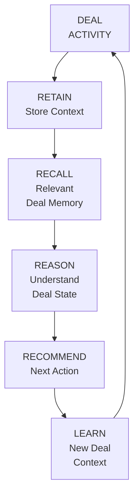
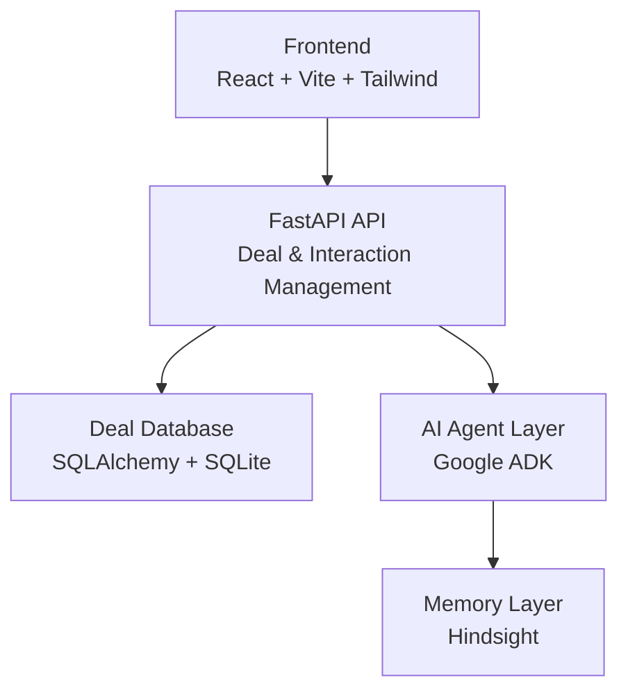

# Precedent

### Persistent-Memory AI Sales Strategist

Precedent is an AI-powered sales strategist that helps sales teams make better decisions by **remembering the history of a deal, understanding its current state, and using that context to recommend what to do next**.

Unlike conventional AI assistants that treat each interaction as an isolated conversation, Precedent is designed around **persistent deal memory** — allowing it to retain relevant context across interactions and use previous deal history when generating recommendations.

Built for **HackWithHyderabad 3.0**.

---

## Why Precedent?

Sales teams often have the information they need, but it is scattered across conversations, notes, meetings, stakeholders, and previous interactions.

This creates a common problem:

> **Every new interaction can feel like starting from scratch.**

Precedent addresses this by maintaining a persistent understanding of each deal.

It can track:

* Deal stage and health
* Stakeholders
* Previous interactions
* Customer objections
* Deal history
* Risks and signals
* Relevant context from earlier conversations

This context can then be used to provide **more informed and explainable next-action recommendations**.

---

## Core Concept

Precedent follows a continuous intelligence loop:



The goal is to turn historical deal information into **actionable sales intelligence** rather than simply generating another chatbot response.

---

# Features

## Deal Management

Precedent provides a structured deal-management layer for tracking sales opportunities.

Each deal can contain:

* Deal name
* Sales stage
* Deal score
* Risk level
* Stakeholders
* Interaction history
* Timeline

Supported stages:

```text
Prospecting
    ↓
Discovery
    ↓
Proposal
    ↓
Negotiation
    ↓
Closed Won / Closed Lost
```

---

## Persistent Deal Memory

Precedent is designed around persistent memory rather than isolated conversations.

Relevant information from previous interactions can be retained and recalled when it becomes useful again.

This enables scenarios such as:

```text
Interaction #1
Customer raises pricing objection
        ↓
Memory stores objection + context
        ↓
Interaction #2
Customer discusses implementation
        ↓
Previous pricing context is recalled
        ↓
AI recommendation considers both interactions
```

The Phase 2 memory layer uses **Hindsight**.

---

## AI Sales Strategy

The AI layer is designed to reason over deal context and help answer questions such as:

* What should the salesperson do next?
* What risks are emerging in this deal?
* Which previous interactions are relevant?
* What objections have already appeared?
* What should be addressed before moving the deal forward?
* Why is a particular action being recommended?

The objective is not simply to generate text, but to provide **context-aware sales decisions grounded in deal history**.

---

## Explainable Recommendations

Recommendations should be grounded in information already associated with the deal.

Instead of:

> "Follow up with the customer."

Precedent aims toward recommendations such as:

> "Follow up with the procurement stakeholder because the pricing objection raised during the previous negotiation has not yet been resolved."

This makes the recommendation more useful and easier for a salesperson to trust.

---

# Architecture



### Technology Stack

| Layer              | Technology       |
| ------------------ | ---------------- |
| Frontend           | React 18         |
| Build Tool         | Vite             |
| Styling            | Tailwind CSS 3   |
| Routing            | react-router-dom |
| Backend            | Python 3.10+     |
| API                | FastAPI          |
| ORM                | SQLAlchemy       |
| Database           | SQLite           |
| AI Agent Framework | Google ADK       |
| Persistent Memory  | Hindsight        |

---

# Project Structure

```text
Precedent/
│
├── backend/
│   ├── app/
│   │   ├── main.py
│   │   ├── models.py
│   │   ├── routes/
│   │   └── seed.py
│   │
│   ├── tests/
│   ├── requirements.txt
│   └── precedent.db
│
├── frontend/
│   ├── src/
│   ├── public/
│   ├── package.json
│   └── vite.config.*
│
├── docs/
│   └── architecture.md
│
├── .env.example
└── README.md
```

> The exact structure may evolve as the AI and memory layers are expanded.

---

# Getting Started

## Prerequisites

Make sure you have:

* Python 3.10+
* Node.js 18+
* npm

---

## 1. Clone the repository

```bash
git clone <repository-url>
cd Precedent
```

---

# 2. Backend Setup

From the repository root:

```bash
pip install -r backend/requirements.txt
```

Start the FastAPI development server:

```bash
uvicorn backend.app.main:app --reload --port 8000
```

The API will be available at:

```text
http://localhost:8000
```

FastAPI's interactive API documentation will be available at:

```text
http://localhost:8000/docs
```

The SQLite database is created automatically on first startup.

---

## 3. Seed Demo Data

To create the demo **Nexora Technologies** deal:

```bash
python -m backend.app.seed
```

To reset and recreate the demo data:

```bash
python -m backend.app.seed --reset
```

---

# 4. Frontend Setup

Open a new terminal:

```bash
cd frontend
npm install
```

Start the development server:

```bash
npm run dev
```

The frontend will normally be available at:

```text
http://localhost:5173
```

For a production build:

```bash
npm run build
```

---

# Environment Variables

Copy the example environment file:

```bash
cp .env.example .env
```

For the frontend, `VITE_API_URL` can be configured in:

```text
frontend/.env.local
```

Example:

```env
VITE_API_URL=http://localhost:8000
```

Additional environment variables required by the AI/memory layers should be configured according to the project's environment configuration.

---

# API

## Health Check

```http
GET /health
```

Checks whether the backend is running.

## List Deals

```http
GET /deals
```

Returns all available deals.

## Create Deal

```http
POST /deal
```

Creates a new deal.

## Get Deal

```http
GET /deal/{id}
```

Returns deal details, stakeholders, and interaction count.

## Update Deal

```http
PATCH /deal/{id}
```

Updates deal attributes such as:

* Stage
* Score
* Risk

## Log Interaction

```http
POST /interaction
```

Adds a new interaction to a deal.

## Deal Timeline

```http
GET /timeline/{id}
```

Returns the interaction timeline for a deal, newest first.

---

# Testing

Run the Phase 1 deal-management tests with:

```bash
pytest tests/test_deals.py -v
```

For the complete test suite:

```bash
pytest -v
```

---

# Development Roadmap

### Phase 1 — Deal Management

* [x] Deal creation
* [x] Deal retrieval
* [x] Deal updates
* [x] Stakeholder tracking
* [x] Interaction logging
* [x] Deal timeline
* [x] Deal scoring and risk tracking
* [x] SQLite persistence
* [x] Backend tests

### Phase 2 — Persistent AI Memory

* [x/→] Hindsight integration
* [x/→] Persistent deal context
* [x/→] Context retrieval
* [x/→] AI agent integration
* [x/→] Context-aware recommendations

### Future Intelligence

* [ ] Competitive intelligence
* [ ] Automated deal-risk detection
* [ ] Recommendation explanations
* [ ] Historical pattern analysis
* [ ] Multi-deal intelligence
* [ ] More advanced sales forecasting
* [ ] Production-grade persistent storage

---

# What Makes Precedent Different?

Traditional CRM systems primarily answer:

> **"What happened to this deal?"**

Generic AI assistants primarily answer:

> **"What should I say or do right now?"**

Precedent aims to answer:

> **"Given everything that has happened in this deal, what should I do next — and why?"**

That distinction is the foundation of Precedent.

---
